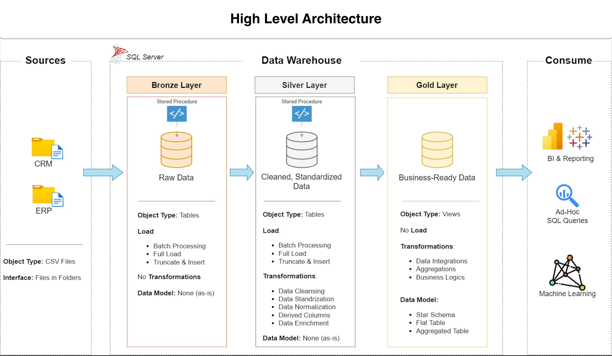

# 🚀 SQL Data Warehouse & Analytics Project

Welcome to my end-to-end **SQL Data Warehouse and Analytics Project**.

This project demonstrates how raw operational data from **CRM and ERP systems** can be transformed into a clean, integrated, and analytics-ready data warehouse using **SQL Server and T-SQL**.

The project follows a **Medallion Architecture** consisting of:

- 🥉 Bronze Layer — Raw Data
- 🥈 Silver Layer — Cleaned & Standardized Data
- 🥇 Gold Layer — Business-Ready Analytical Data

The final Gold layer follows a **Star Schema** consisting of customer and product dimensions surrounding a central sales fact table.

The complete pipeline covers:

> **Data Ingestion → Data Cleansing → Data Standardization → Data Integration → Data Quality → Dimensional Modeling → Analytics**

---

# 🏗️ Data Architecture

<p align="center">
  
</p>

The warehouse follows a three-layer Medallion Architecture.

### 🥉 Bronze Layer

The Bronze layer stores the data as it arrives from the source systems.

The objective of this layer is to preserve the original source information and provide a reliable landing zone for downstream processing.

**Sources:**

- CRM
- ERP
- CSV files

---

### 🥈 Silver Layer

The Silver layer transforms raw source data into clean and trusted data.

Major transformations include:

- Removing unwanted spaces
- Handling NULL values
- Standardizing categorical values
- Cleaning customer identifiers
- Cleaning product identifiers
- Validating dates
- Handling invalid numerical values
- Removing duplicate customer records
- Integrating CRM and ERP information
- Applying business rules

---

### 🥇 Gold Layer

The Gold layer contains business-ready analytical data.

The final model consists of:

- `gold.dim_customers`
- `gold.dim_products`
- `gold.fact_sales`

This layer is designed for:

- Reporting
- Business Intelligence
- Analytical SQL
- Dashboard development
- Future Machine Learning applications

---

# 📖 Project Overview

The project was designed to simulate a real-world enterprise data warehouse where information is distributed across multiple operational systems.

The CRM system provides:

- Customer information
- Product information
- Sales transactions

The ERP system provides:

- Additional customer information
- Customer location
- Product category information

These sources are independently loaded into the Bronze layer and subsequently transformed and integrated within the Silver layer.

The Gold layer then reorganizes the information into a business-friendly dimensional model.

---

# 🎯 Project Objectives

The primary objectives of this project are:

### 1. Build a Data Warehouse

Create a structured SQL Server data warehouse capable of consolidating CRM and ERP data.

### 2. Develop ETL Pipelines

Build repeatable loading processes for Bronze and Silver layers.

### 3. Improve Data Quality

Identify and resolve:

- Duplicate records
- NULL values
- Invalid dates
- Inconsistent categories
- Unwanted spaces
- Invalid numerical values
- Referential integrity issues

### 4. Integrate Multiple Sources

Combine CRM and ERP data into unified customer and product entities.

### 5. Build an Analytical Data Model

Create a Star Schema optimized for analytical queries.

### 6. Validate the Final Data

Develop dedicated Silver and Gold quality-check scripts.

---

# 🔄 End-to-End Data Flow

<p align="center">
  
</p>

The complete data flow is:

```text
CRM Sources ───────┐
                   │
                   ▼
              🥉 BRONZE
                   │
                   ▼
            Data Cleansing
                   │
                   ▼
          Standardization
                   │
                   ▼
             Validation
                   │
                   │
ERP Sources ───────┘
                   │
                   ▼
              🥈 SILVER
                   │
                   ▼
            Data Integration
                   │
                   ▼
             Business Rules
                   │
                   ▼
               🥇 GOLD
                   │
          ┌────────┼────────┐
          ▼        ▼        ▼
      Customers Products  Sales
          │        │        │
          └────────┼────────┘
                   ▼
              STAR SCHEMA
                   │
                   ▼
            BI / Analytics
